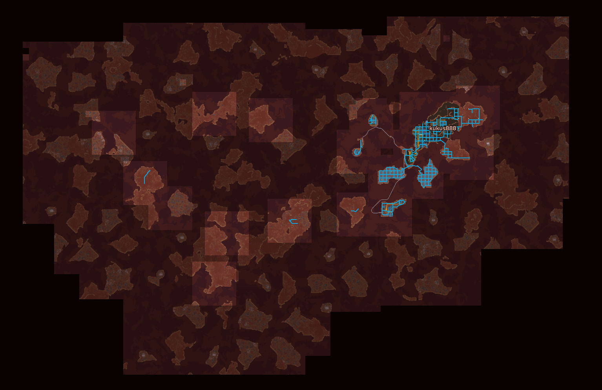
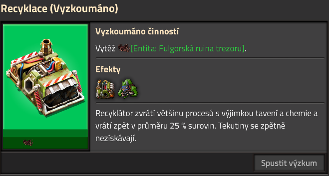
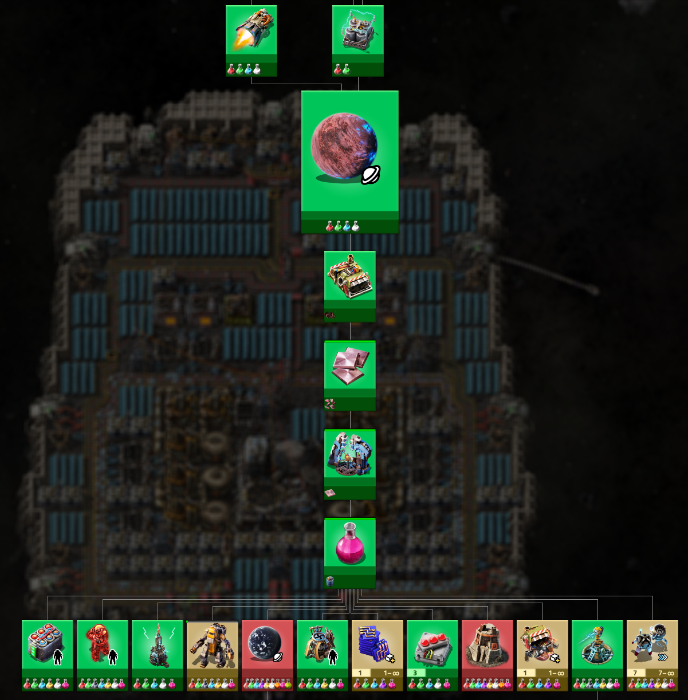
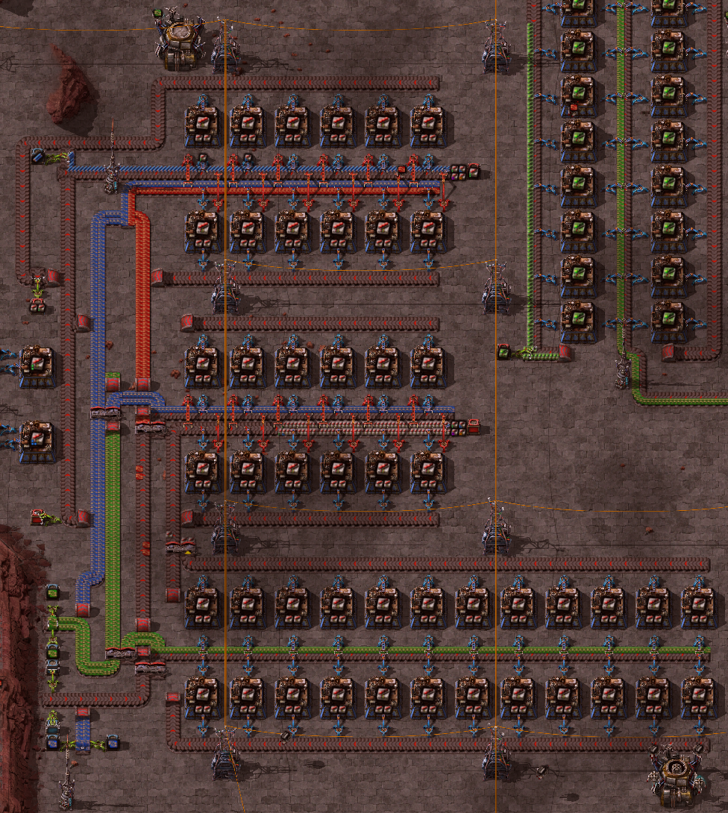
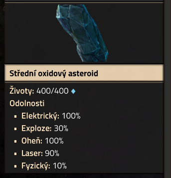

# Factorio Space Age review

Who am I? Some stranger on the internet. Tired IT guy, who had huge expectations of the expansion, but after playing for a while, didn't find it as interesting. Some stats:

| Stat | Play time (hrs) |
| --- | --- |
| Factorio steam combined | 1352 |
| Factorio Space Ex Save | 77 |
| Factorio Space Age Save | 32 |

What do i expect? Well, what developers promised. New DLC that will be basically four times as big (due to the new planets), with new graphics, play abilities, sounds, enemies, etc. All bug-free and highly addictive.

## Let's go

I will try to explain my findings chronologically as i went through the game. 

### Keybinding; Who tf changes keybinds? 

In early game, i wanted to go clear some nests. Place some turrets, drop some ammo into them, watch the mayhem. After my ammo is depleted, i want to change to secondary weapon. I press `Tab`, and... What? Why the hell is map open? Later i found out, that the Factorio 2.0 release contained *some* keybind changes (Same with flip `H`orizontal/`V`ertical). I'd like to make very clear that this change drove me most furious of them all. 

When i made plans to visit my second planet (Nauvis is first ;) ), Fulgora, i was so eager that i didn't set up yellow science. That meant that when i was finally up and running on Fulgora, i noticed that i can't research much, since i needed yellow science. I don't think you should need yellow science to research the planet, quite the opposite. But i think that the yellow science research should be prerequisite for exploring planets. Just to tip off the player, like "Hey, you might want this too!". 

But that is nothing the Remote view can't fix, right? In this case, yes. Otherwise, it's terrible compared to SpaceEx's Sattelite view. In SpaceEx, you have to deploy a sattelite to have SatView (you have normal map otherwise). What this SatView does is, that you can remotely see any piece of terrain, anywhere, regardless of radar coverage, you can even uncover new terrain! This is a bit op, but could be perhaps fixed by needing a sattelite per planet, where the SatView could be used. Space Age definitely needs this as some sort of upgrade. 

So to Fulgora i went. Made a spaceship, landed, started mining resources, etc... I hate the fact that you cannot have anything in your inventory when riding spacecraft. I was not clever enough to bring some starting supplies in the rocket, but Fulgora is known for it's resourcefulness. It's just an unnecessary hassle that i don't like. 

This bit is just rambling, you can skip it. If only was i clever enough to bring some resources... I didn't, and i became a human sorter (is this what work at Amazon is like?). You know, recycler recycled stuff, i sorted it, until i had some splitters. But even then, the chests need some overflow handling. So sorting manually it is again. This was quite tedious and lengthy part. Combined with stormy weather, i couldn't explore much. Also, the islands i was uncovering were way too small. I travelled a lot until i gave up and just found something bigger nearby.

In the end i settled for one of the bigger islands nearby. It was a pain searching for the new base (home).

### Tech tree upgrades
The tech tree has recieved many new technologies, and some new... I don't know what to call them. Researching with actions. Let's call them actionsearch. 

I do not know why they are included. I think they're pointless, and in some cases restricts the player from playing the game (can't set up uranium processes without mining it first). They would make sense if the player would be inexperienced, and didn't know (or want to) experiment with stuff (fuck around and find out (TM)). I mean, we have all played Factorio <= 2.0.0 without it, do devs really think we **need it**?

What's worse, i have always liked the complicated tech tree. You know, open the tree and see the complicated mess that you will one day research and build. But some of the research tree just seems... Empty...

Look, it's cold, lonely, and empty!

I also think planets should **NOT** be included in research tree. Perhaps there should be some kind of telescope that will scour the vast emptiness of space for planets? Imagine if you needed to build a telescope in space, and it would search. Maybe if you found a planet, you'd need to send a sattelite to investigate... Or just YOLO it and fly there. I bet someone would make this mechanic more interesting over a glass of beer in the pub. 

### Quality
I was hesitant about quality upgrades at first. It was new, very weird and chaotic way to make things. Better things. I tried my best, but rage quit after a while. You see, i had three moderately sized module factories (Speed, Quality, Production), filled with quality modules 2. I thought devs would make quality a bit more lax, but i think they wanted to see some quality *hehe* builds. I wanted to chug everything into an assembler, and if there comes a better tier of the product out, great! If not, whatever... 

Turns out you can't do that. You can't have quality products without having quality factories. I can see the logic, and i don't like it. 

### Segmentation of planets
It seems to me like devs wanted to mash more different factorio play styles (different planets) together, but fumbled how. Look! I can build crazy recycling contraptions, recycling thousands of items on Fulgora, but I am unable to do so on Nauvis. This goes hand-in-hand with constraints introduced in 2.0; for e.g. you have to have pressure higher than X to build a thing, etc. I think that's pretty neat way to decouple building requirements from environments, and i think the modder community will take great advantage of these contraints, but they have to be properly configured. I don't think they are. Let me make recyclers on other planets! Let me catch non-existent lightnings on Nauvis! 

### Bugs and features
Interacting with ghosts; Let's say i set a blueprint for e.g. requestor chest (idk if that's the correct translation), and edit the configuration of the chest. When i have the chest UI opened, and the chest is placed (usually by a bot), the UI closes, and i have to reopen it again. 

Interacting with rocket silo's; When a rocket is deployed from rocket silo, there's a small period of time where you can still see the contents of the rocket (this is fine). But sometimes, after the content clears, and a new rocket start coming up onto the ramp, i cannot shift click on an item, or manually transfer them there without reopening the rocket silo UI. 

### Nerfs

**Lasers** - I personally don't like when things change for something worse. But with lasers, i get it, and in this case i'm not even mad. Lasers were very op, and still can be. It also makes sense they're basically useless at disintegrating meteors. I am no expert on physics, but maybe you could melt asteroids with lasers. 

## Summary

Please note that i have visited only 2 planets so far (Nauvis and Fulgora), and most definitely don't have enough information to go about. But my interest in this expansion is fading, and i don't know if i will be able to brace myself to play more of it. In my opinion, Space Age is just plain old game, with stuff shuffled around, some on new planets, with some new mechanics, and with absolutely magnificent graphics, sounds, and environments. There just isn't enough dope to keep me hooked.

And i think that sums up *the vibe* (i hate myself for using this expression) of the first Factorio DLC. It looks amazing, the environment is fabulous, even the barren planets seem somewhat... alive. Unfortunately for me Space Age brings very little improvements to the table, compared to SpaceEx and my expectations. New planets also feel not as rewarding.

I have however high hopes in the Factorio dev team. I am sure they will tidy up all bugs, balance some things out, and maybe add bit more content to the DLC (probably not, but i can hope). Otherwise the DLC contains very solid foundations for modders.
